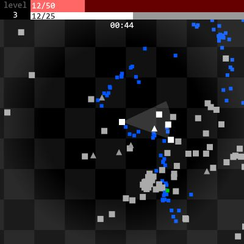
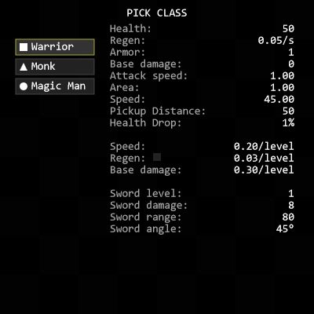
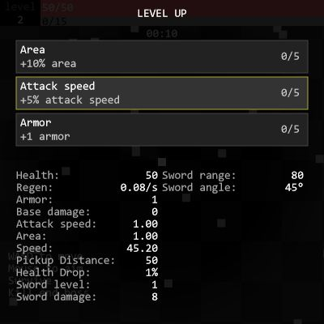
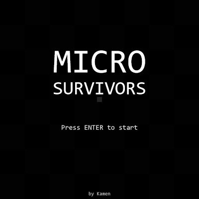

# Micro Survivor

Tiny survivors-like game that fits under 14 kB of minified JS code.

## Features

- multiple player classes
- 3 different weapons
- bosses
- 14 kB minified, 7 kB gzipped

## Screenshots






## Embedding into your website

Use gh-compatible CDN (jsDeliver as example here) to load the latest minified version and then call `microSurvivors` global function to start the game.

```html
<script src="https://cdn.jsdelivr.net/gh/SkaceKamen/micro-survivors@main/main.min.js"></script>
<script>
  // injects the game canvas into element with id="survivors"
  microSurvivors(document.querySelector("#survivors"));
</script>
```
